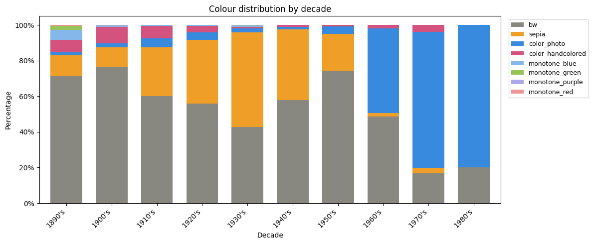
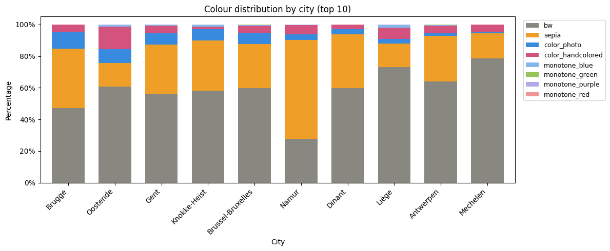
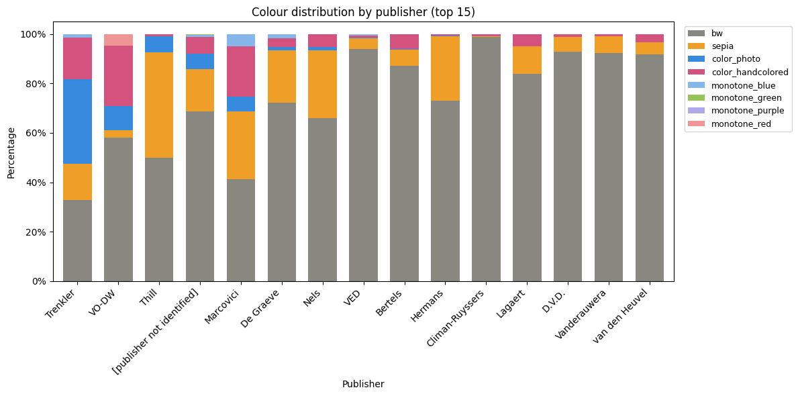

# Postcard Colour Classification

During the 2026 KU Leuven BiblioTech Hackathon, our team Inked and Stamped worked on the [Belgian historical postcards](https://kuleuven.limo.libis.be/discovery/collectionDiscovery?vid=32KUL_KUL:KULeuven&collectionId=81531489730001488&lang=en) dataset from KU Leuven Libraries digitized collections.
This repository presents the colour analysis pipeline I developed for 35,930 postcard images, with the goal of producing a more consistent and reusable colour labelling system.

## Overview

Historical postcard metadata often contains inconsistent and subjective colour labels. The same image may be labelled differently, and manual annotation is difficult to scale. This makes it hard to search, compare, or analyse images across the collection.

To address this, I built an end-to-end colour analysis pipeline that learns colour directly from the images rather than relying solely on metadata.

The pipeline:

- processes 35,930 postcard images  
- extracts more than 50 visual colour features  
- combines:
  - supervised learning (Random Forest)
  - unsupervised clustering (GMM)
  - rule-based refinement  
- produces a consistent system of 8 colour categories  

Metadata is used as guidance rather than ground truth, clustering is used to discover structure in the data, and post-processing rules ensure that the final categories remain semantically meaningful.

## Final Categories

| Category | Description |
|----------|------------|
| `bw` | Black-and-white |
| `sepia` | Sepia / warm brown tones |
| `monotone_blue` | Blue monotone print |  
| `monotone_red` | Red monotone print |  
| `monotone_green` | Green monotone print |
| `monotone_purple` | Purple monotone print |
| `colour_handcoloured` | Hand-coloured image |  
| `colour_photo` | Real colour photograph |

## Pipeline

### Step 1 — Feature Extraction  
`02_src/01_extract_colour_features.py`

Extracts 50 colour features per image using OpenCV and NumPy, including:

- saturation distribution  
- hue diversity  
- sepia pixel ratio  
- opponent colour channels  

### Step 2 — Metadata-Guided Classification  
`02_src/02_metadata_colour_classification.py`

A Random Forest classifier is trained using postcards with existing metadata colour labels.  
Instead of treating metadata as fully reliable ground truth, only the three most consistent high-level categories are used:  

- black-and-white  
- sepia  
- colour  

The model learns to map visual features to these broad categories and is then applied to all images, ensuring that every postcard is consistently assigned to one of the three groups.

### Step 3 — Fine-Grained Classification  
`02_src/03_fine_grained_classification.py`

Applies GMM sub-clustering within each broad category to produce six sub-categories.

Post-processing rules:

- merge GMM clusters for black-and-white and sepia to maintain semantic consistency  
- identify monotone printing styles (blue, green, purple, red) from metadata  
- consolidate all outputs into a unified set of 8 final categories  

## Notebooks

- `03_notebook/01_post_processing.ipynb`  
  Applies and validates post-processing rules  

- `03_notebook/02_colour_analysis_insights.ipynb`  
  Explores colour distribution by decade, city, and publisher  

## Data

- `01_data/00_metadata/20230301-Postcards.csv`  
  Original metadata  

- `01_data/01_processed/postcard_fine_labels.csv`  
  Final colour labels for all 35,930 postcards  

## Key Findings

- This pipeline provides a more standardised and consistent colour labelling system by combining visual features with metadata-guided modelling.  
  In particular, it consolidates previously inconsistent labels into a unified taxonomy, enabling more reliable comparison and analysis across the collection.

- A clear temporal shift is observed across decades.  
  Earlier postcards are dominated by black-and-white and sepia imagery, with sepia peaking around the 1930s.  
  From the 1960s onwards, colour photographs increase sharply and become the dominant format by the 1970s and 1980s.

- colour usage varies across cities.  
  Most cities are dominated by black-and-white postcards, with this pattern being particularly strong in Liège and Mechelen.  
  In contrast, Namur stands out with a high proportion of sepia images.  
  Brugge shows a more balanced distribution, with black-and-white, sepia, and colour postcards (including colour photographs and hand-coloured images) appearing in relatively similar proportions compared to other cities.  
  Interestingly, Oostende is notable for having a notably higher proportion of hand-coloured postcards.  
  These differences likely reflect variations in time period, local publishing practices, and the intended use of postcards across different locations.

- Distinct colour preferences can be observed across publishers.  
  Several publishers (e.g. V.E.D, Bertels, Vanderauwera, van den Heuvel) predominantly produce black-and-white postcards, while others such as Thill and Nels show a higher proportion of sepia prints.  
  In addition, some publishers exhibit strong associations with specific colour styles, for example Marcovici with monotone blue prints and VO-DW with monotone red prints.  
  This suggests that colour usage is not only influenced by time period but also shaped by publisher-specific stylistic or production choices.

  ### Final colour Categories

### colour Distribution by Decade

### colour Distribution by City

### colour Distribution by Publisher

## Limitations

- The pipeline achieves strong classification results within 10 days, but remains imperfect.  
- Some oil paintings are classified as photographs.  
- colour features alone cannot fully capture semantic image types, such as distinguishing between photographic and illustrated content.  

## Next Step

Use CLIP embeddings to:

- distinguish photographs from paintings  
- combine visual semantics (CLIP) with colour features from the current pipeline  

This would enable richer and more accurate cultural heritage metadata.
